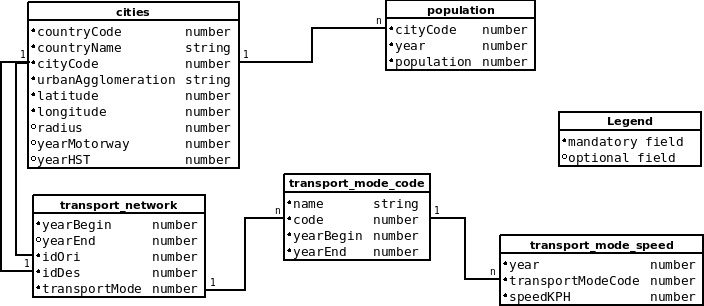

# Instructions for the creation of a dataset

## Data model

## A system of five files

According to the data model, _Shriveling world_ datasets are composed of five files:
1. cities
2. population
3. transport network
4. transport modes
5. transport mode speed

The files describe a __graph__ modelling a transport network between cities with __speed__ as a key parameter.

## A differential model

The _Shriveling world_ model is by design __differential__, id est, it compares the basic terrestrial road speed with the fastest available transport speed. This comparison of speed computes a ratio that will determine the slope of cones. Addressing the issue of the historical contraction of time-space due to the improvement of transport means, the  _Shriveling world_ model allows for considering different periods in time, years, different moments when the ratio is computed. The ratio is fixed for a given year.

## Historical time span

The dataset will generate a _historical time span_ during which, for each year, a graphical representation may be built. This _historical time span_ considers the dates attached to the modes and network links but also the coexistece of road and other transport modes. This coexistence of transport modes is necessary to generate the cones slope, [as seen earlier](#a-differential-model). Hence the _historical time span_ is based on data provided about the year of opening and sometimes ending (e.g. supersonic aircraft) of the transport services, an on the period where __road speed and another faster transport mode speed__ are known.
The _historical time span_ needs to fill in the variable _yearBegin_ and the variable _yearEnd_
* _yearBegin_ will be the earliest year when the model can be computed
* _yearEnd_ will be the latest year when the model can be computed

There are two sources to determine this _historical time span_:
Source | Rationale
----------|----------
_transport mode speed.csv_ | to allow for comparing modes in general, e.g. road vs rail in the long term
_transport network.csv_ | to allow for considering the growth of a transport network of a given speed, over time, e.g. the morphogenesis of the high-speed rail network

## Algorithm for determining the historical time span

Algorithm for determining the variables _yearBegin_ and  _yearEnd_:

Source file | Starting year for each mode | Ending year for each mode
----------|----------|----------
_transport mode speed.csv_ | _yearBeginRoadMode_ = min(_yearroad_), _yearBeginFasterTransp1Mode_ = min(_yearTransp1_), _yearBeginFasterTransp2Mode_ = min(_yearTransp2_), etc.|  _yearEndRoadMode_= max(_yearroad_), _yearEndFasterTransp1Mode_ = max(_yearTransp1_), _yearEndFasterTransp2Mode_ = max(_yearTransp2_), etc.
_transport network.csv_ | _yearBeginRoadNetwork_ = min(_yearBeginroad_), _yearBeginFasterTransp1Network_, _yearBeginFasterTransp2Network_, etc.| _yearEndRoadNetwork_ = max(_yearEndroad_), _yearEndFasterTransp1Network_, _yearEndFasterTransp2Network_, etc.

_yearBeginRoad_ = min (_yearBeginRoadMode_, _yearBeginRoadNetwork_)
_yearBeginFasterTransp1_ = min (_yearBeginFasterTransp1Mode_, _yearBeginFasterTransp1Network_)
_yearBeginFasterTransp2_ = min (_yearBeginFasterTransp2Mode_, _yearBeginFasterTransp2Network_)
etc.

_yearEndRoad_ = max (_yearEndRoadMode_, _yearEndRoadNetwork_)

_yearBegin_ = max((_yearBeginRoad_), min(_yearBeginFasterTransp1_, _yearBeginFasterTransp2_, etc.))
_yearEnd_ = min((_yearEndRoad_), max(_yearEndFasterTransp1_, _yearEndFasterTransp2_, etc.))

The transport related period should also be coherent with the dates of the city population data.

## Mandatory elements in the dataset
* The [five files](#a-system-of-five-files) must all be present in the dataset
* As shown in the [figure of the data model](#data-model) each file has optionnal and mandatory columns
  * mandatory columns must be populated completely, with no missing data
  * optionnal columns may be left empty or may be completely or partially populated
* Id fields must be carefully populated because they connect files to each other:
  * _cityCode_ from the city file is linked to _iOri_ and _iDes_ in the network file
  * _transportMode_ code from the transport network file is linked to _code_ in the transport mode code file, and _transporModeCode_ in the transport mode speed file
  * text: _countryName_, _urbanAgglomeration_, _name_ (of transport mode)
  * numeric: _countryCode_, _cityCode_, _latitude_, _longitude_, etc

## Content of columns

Cities file:

Column name | type | explanation
----------|----------|-------------
_countryCode_ |number| numeric code of country where city belongs
_countryName_|string| country name where city belongs
_cityCode_|number|city id